Paso a paso:
```js
Luego de conectar nuestra VPN y encender la maquina. Vamos a realizar un ping 
hacia la direccion ip de la maquin atacada para poder corroborar que tenemos
conexión:
```
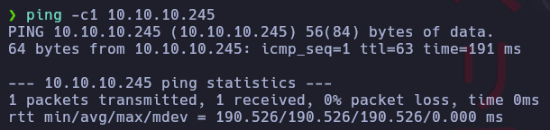

```js
Como el TTL es 63 podríamos decir que es una maquina Linux ya que:
```


```js
Hago dos análisis de puertos para ver que puertos estan abiertos. El primero 
es algo mas sigiloso solamente para ver cuales estan abiertos y el segundo es
mas agresivo para ver las versiones:
```


```js
Hago un análisis de la web:
```

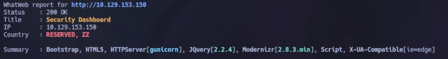

```js
Entramos a la ip a través de Firefox y seguramente nos entre a /data/o pero 
por las dudas revisamos y sino ponemos 0 en data en la url:
```
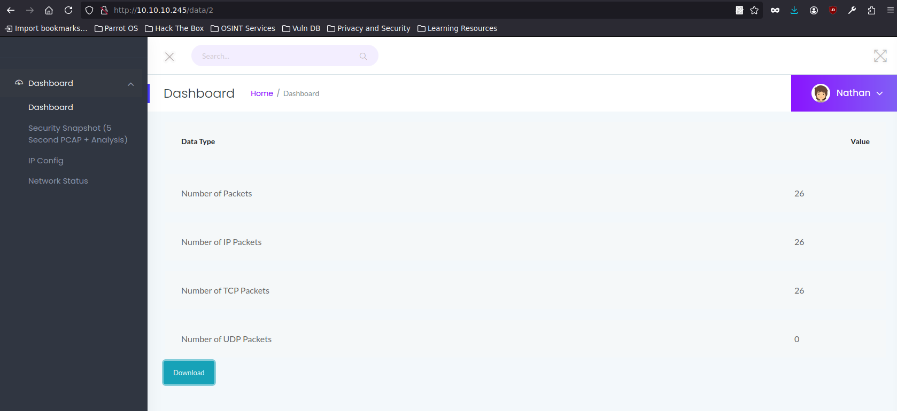

```js
Descargamos el reporte.
```

```js
En la terminal lo movemos a la dirección donde estamos trabajando:
```
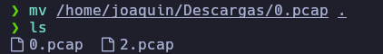

```js
Lo abrimos:
```


```js
Observamos que hay un usuario y contraseña:
```
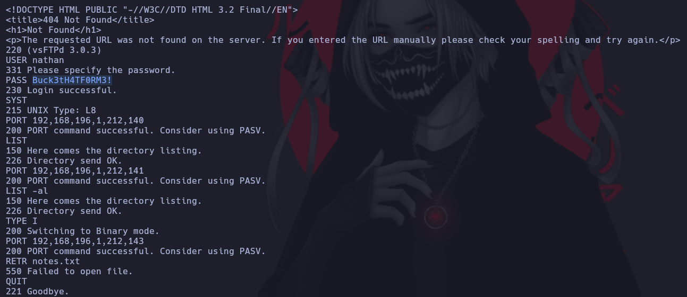

```js
Hago un ftp para establecer una conexion con el servidor a traves del usuario 
que descubrimos y la contrasena:
```
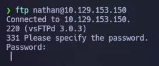

```js
Descargo el user.txt:
```
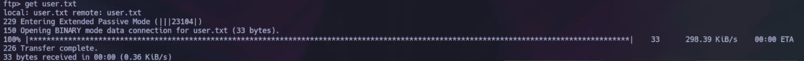

```js
Dentro del Archivo encontramos en hash del user:
```


```js
Ahora ingreso por ssh al dispositivo:
```


```js
Busco linpeas.sh para encontrar un exploit que me permita escalar privilegios:
```
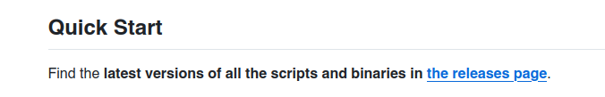

```js
Descargo:
```


```js
Lo pego en mi terminal:
```


```js
Envio por curl una copia del archivo:
```
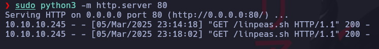

```js
Despues lo ejecuto remotamente:
```
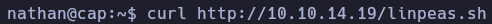

```js
Espero a que se active correctamente:
```


```js
Ejecuto un python3:
```
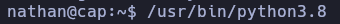

```js
Ejecuto:
```


```js
Ejecuto:
```


```js
Y finalmente:
```
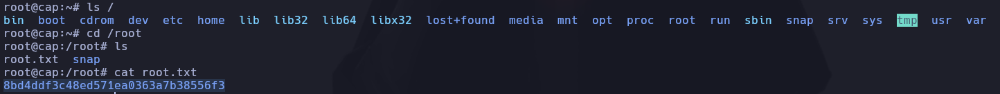


