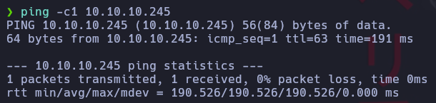
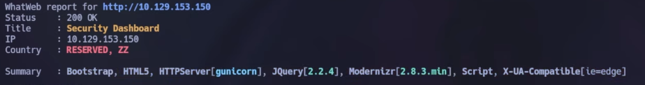
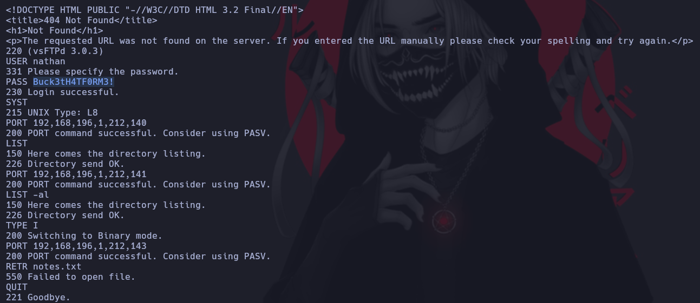

### Paso a paso:

- Luego de conectar nuestra VPN y encender la maquina. Vamos a realizar un ping 
    hacia la direccion ip de la maquin atacada para poder corroborar que tenemos
    conexión:

- Como el TTL es 63 podríamos decir que es una maquina Linux ya que:

- Hago dos análisis de puertos para ver que puertos estan abiertos. El primero 
    es algo mas sigiloso solamente para ver cuales estan abiertos y el segundo es
    mas agresivo para ver las versiones:

- Hago un análisis de la web:

- Entramos a la ip a través de Firefox y seguramente nos entre a /data/o pero 
    por las dudas revisamos y sino ponemos 0 en data en la url:

- Descargamos el reporte.

- En la terminal lo movemos a la dirección donde estamos trabajando:

- Lo abrimos:

- Observamos que hay un usuario y contraseña:

- Hago un ftp para establecer una conexion con el servidor a traves del usuario 
    que descubrimos y la contrasena:

- Descargo el user.txt:

- Dentro del Archivo encontramos en hash del user:

- Ahora ingreso por ssh al dispositivo:

- Busco linpeas.sh para encontrar un exploit que me permita escalar privilegios:

- Descargo:

- Lo pego en mi terminal:

- Envio por curl una copia del archivo:

- Despues lo ejecuto remotamente:

- Espero a que se active correctamente:

- Ejecuto un python3:

- Ejecuto:

- Ejecuto:

- Y finalmente:

