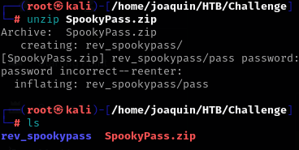
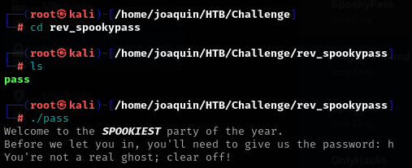
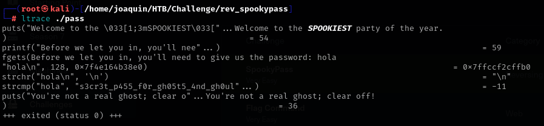
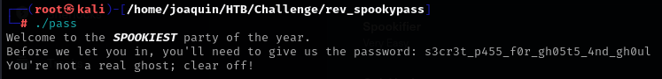
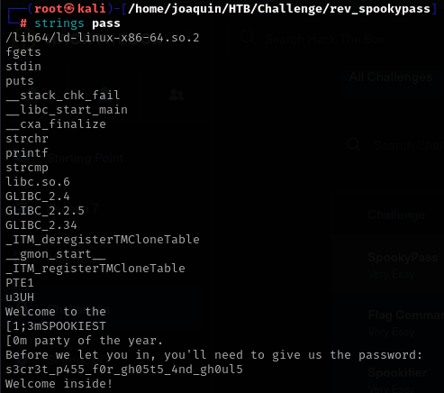
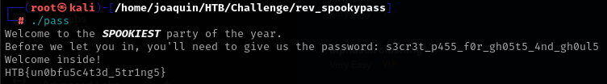

### Paso a paso:


- Descargo el archivo .zip que me dan para el ejercicio


- Lo muevo a mi carpeta de trabajo


- Y lo descomprimo usando unzip, acordarse que la contrasena siempre va a ser 
"hackthebox": 


- Entro a la carpeta y ejecuto el script que hay y me pide escribir una contrasena y 
me dice que no soy un real fantasma dando a entender que la contrasena no es 
correcta:



```js
Ejecuto ltrace para ver a que compra la contraseña que puse:
```



```js
Ejecuto nuevamente y pongo la contrasena correcta y me dice nuevamente contrasena 
erronea:
```



```js
Le aplicxo una strings para ver elcodigo y veo que por alguna razon se le escapaba 
un "5" a la contrasena:
```



```js
Ejecuto nuevamente y pongo la contrasena correcta y me da la flag:
```
