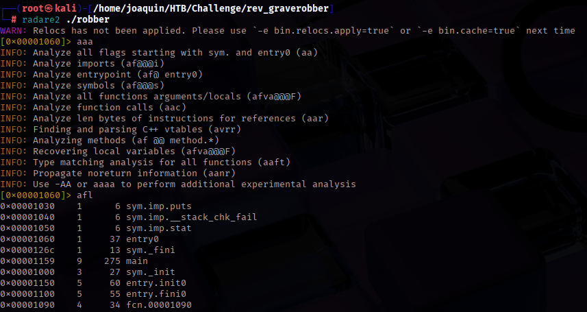
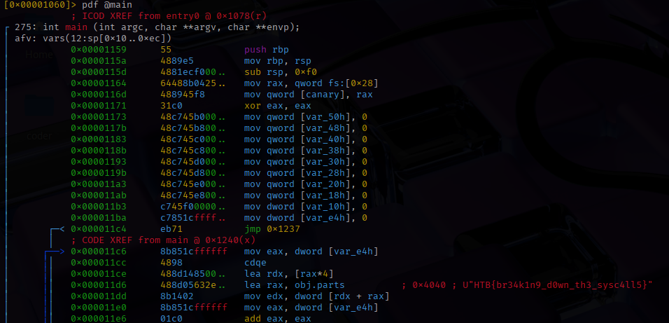

### Paso a paso:

- Descargo el archivo .zip que me dan para el ejercicio.

- Lo muevo a mi carpeta de trabajo.

- Y lo descomprimo usando unzip, acordarse que la contrasena siempre va a ser "hackthebox": 

- Entro al archivo y le aplico un radare2 al archivo:
    

- Luego un pdf @main:

- Y veo la flag:
    
