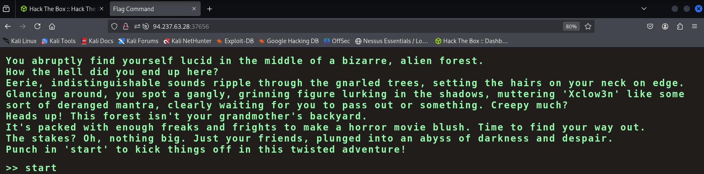
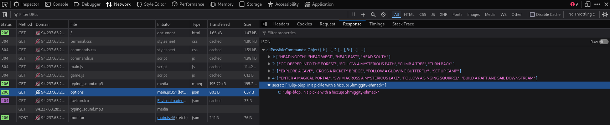
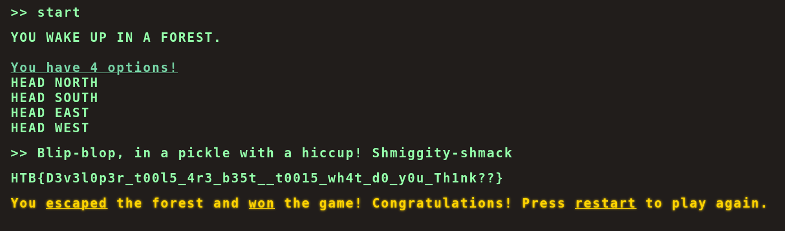

### Paso a paso:

- Me conecto a la VPN y prendo el challenge.

- Copio la IP web que me dieron y la abro:

- Pongo start.

- Al jugar y ver que no llegaba a ninguna parte uso Ctrl + Shift + C.

- Analizo las peticiones red.

- Entro a la petición options.

- Y veo un comando secreto:

- Inicio el juego y pego el comando secreto y me da como respuesta la flag:

