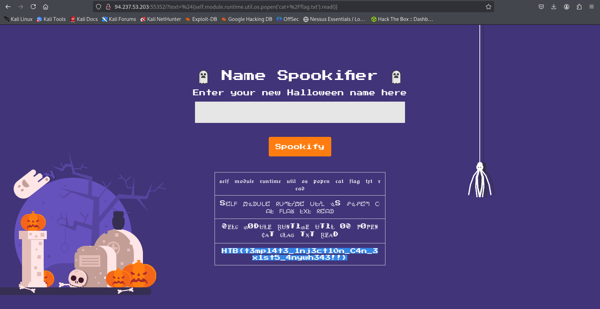
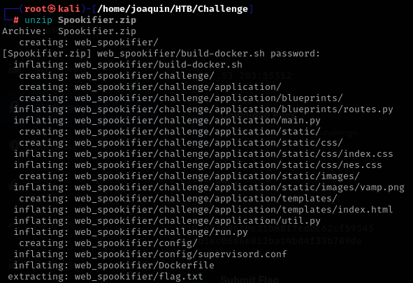
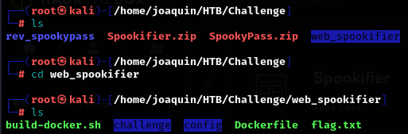
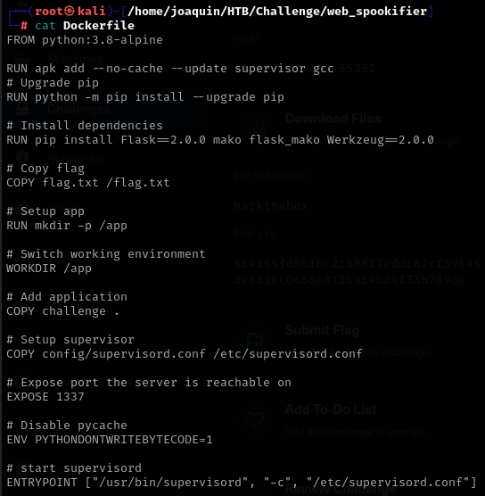
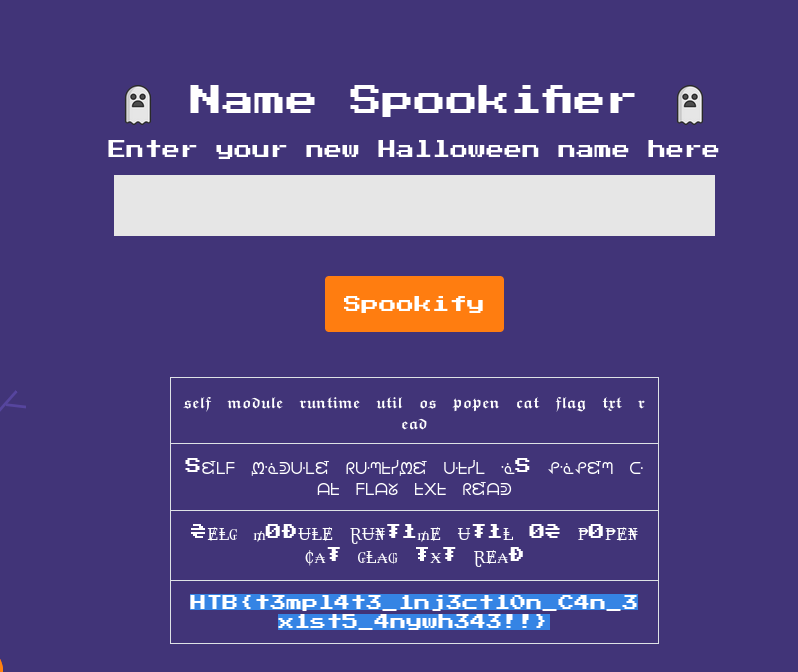

### Paso a paso:

- Enciendo el entorno virtual y entro a la direccion que me proporcionan: 
    

- Descargo el archivo .zip que me dan para el ejercicio.

- Lo muevo a mi carpeta de trabajo.

- Y lo descomprimo usando unzip, acordarse que la contrasena siempre va a ser 
    "hackthebox": 
    

- Entro al archivo y empiezo a mirar:

- En dockerfile veo que me dice que la flag esta en el directorio /flag.txt:

- Además veo que usa python y una distro de python que es mako.

- Busco PayloadsAllTheThings, que es un directorio de payloads.

- Entro a Server Side Template Injection y busco una versión mas vieja para 
    que este mas ordenado.

- Empiezo a probar payloads y descubro que:
    ${self.module.runtime.util.os.system("id")}

- Pareciera funcionar y le cambio por :
    ${self.module.runtime.util.os.popen('id').read()}

- Como en dockerfile decia que la flag estaba en el directorio /flag le hago un cat:
    ${self.module.runtime.util.os.popen('cat /flag.txt').read()}

- Y descubro la flag:
