### Paso a paso:

- Descargo y descomprimo los archivos.

<div style="height: 5px;"></div>

- Entro a los dos links q me dieron: 
    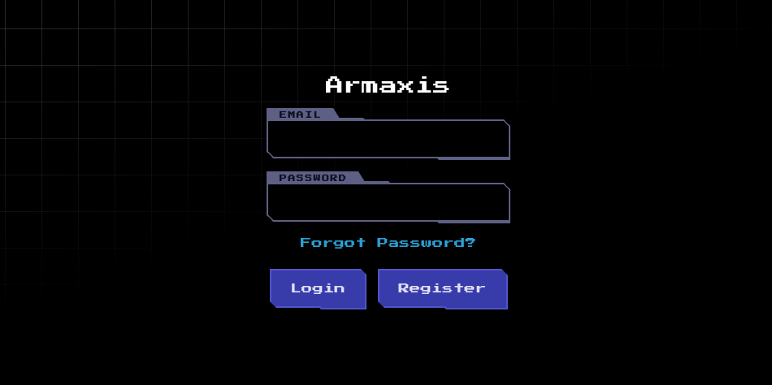
    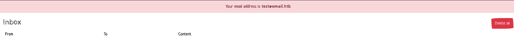

<div style="height: 5px;"></div>

- Pruebo registrarme con el mail test@email.htb:
    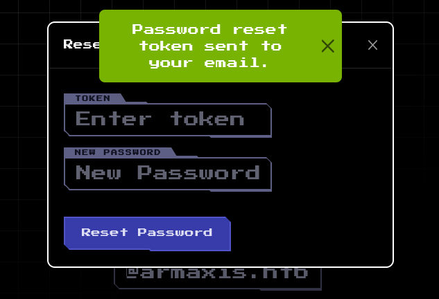
    
<div style="height: 5px;"></div>

- Pruebo cambiar la contraseña y me mandan un token:
    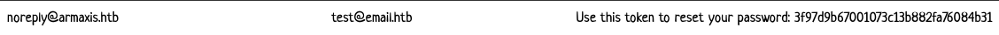

<div style="height: 5px;"></div>

- Entonces veo desde donde me mandan el mail y pruebo admin@armaxis.htb: 
    

<div style="height: 5px;"></div>

- Veo que el usuario existe y veo de cambiar la contraseña.

<div style="height: 5px;"></div>

- Después veo el código del funcionamiento de cambiar la contraseña.

<div style="height: 5px;"></div>

- En [[cat]] routes/index.js:
    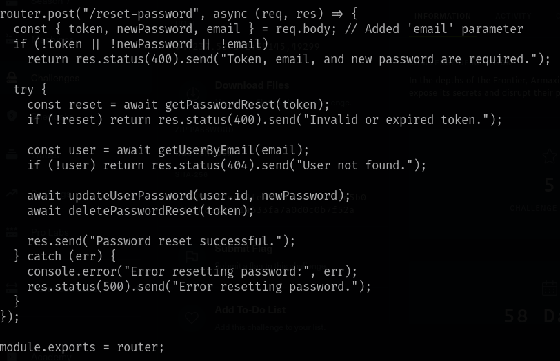

<div style="height: 5px;"></div>

- Veo que genera un token pero que no deja de estar activo hasta que se usa.

<div style="height: 5px;"></div>

- Por lo que hago es pedir cambiar la contraseña del mail al que si tengo acceso para que me manden un token:
    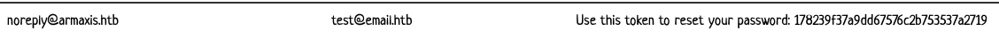

<div style="height: 5px;"></div>

- Para después pedir cambiar la contraseña del mail admin e introducir el token mío:
    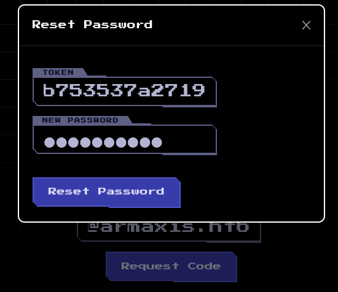

<div style="height: 5px;"></div>

- Me deja cambiar la contraseña y acceso al usuario admin.

<div style="height: 5px;"></div>

- Hago un cat a Dockerfile y veo la dirección de la flag:

<div style="height: 5px;"></div>

- Veo el código y la flag esta en flags.txt:
    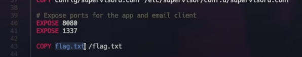

<div style="height: 5px;"></div>

- Veo que hay una sección de introducir un pedido:
    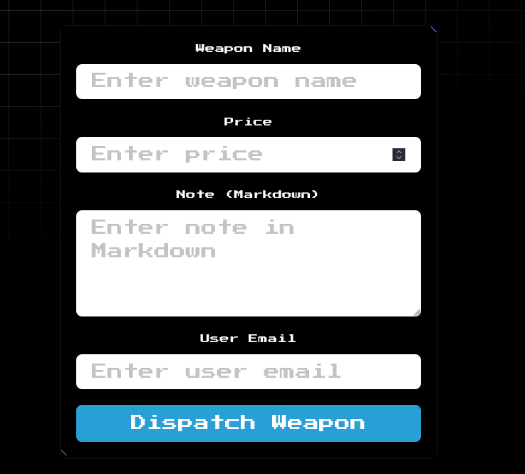

<div style="height: 5px;"></div>

- Pruebo meter un pedido y no pasa nada:
    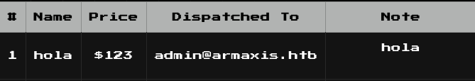

<div style="height: 5px;"></div>

- Reviso y veo que en la zona de notas pide markdown y al revisar el codigo veo:
```js
┌──(root㉿kali)-[/home/…/HTB/Challenge/web_armaxis/challenge]
└─# cat markdown.js
const MarkdownIt = require('markdown-it');
const { execSync } = require('child_process');

const md = new MarkdownIt({
    html: true,
});

function parseMarkdown(content) {
    if (!content) return '';
    return md.render(
        content.replace(/\!\[.*?\]\((.*?)\)/g, (match, url) => {
            try {
                const fileContent = execSync(`curl -s ${url}`);
                const base64Content = Buffer.from(fileContent).toString('base64');
                return ``;
            } catch (err) {
                console.error(`Error fetching image from URL ${url}:`, err.message);
                return `<p>Error loading image: ${url}</p>`;
            }
        })
    );
}

module.exports = { parseMarkdown };
```
    
<div style="height: 5px;"></div>

- Veo que en content.renplace te deja introducir un comando que se ![texto] (texto)

<div style="height: 5px;"></div>

- Te dice además q uses img y que te va devolver un base64 embebido en un embedded image. 

<div style="height: 5px;"></div>

- Entonces veo si así puedo conseguir algo:
    Pruebo:
    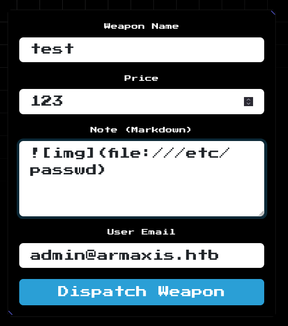

<div style="height: 5px;"></div>

- Que me da como respuesta:
    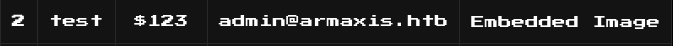

<div style="height: 5px;"></div>

- Aplico un Ctrl + Shift + C sobre la imagen embebida:
    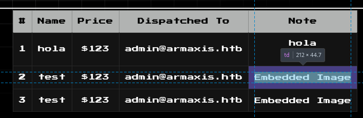

<div style="height: 5px;"></div>

- Veo el codigo:
    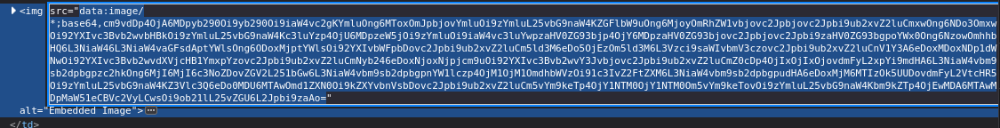

<div style="height: 5px;"></div>

- Descomprimo:
    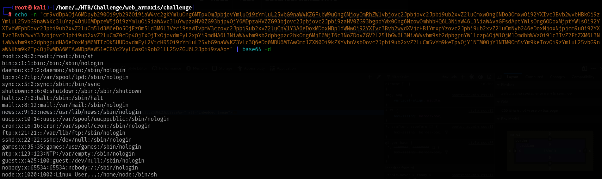

<div style="height: 5px;"></div>

- Al ver que si funciona pruebo con la localizacion de la flag que vi:
    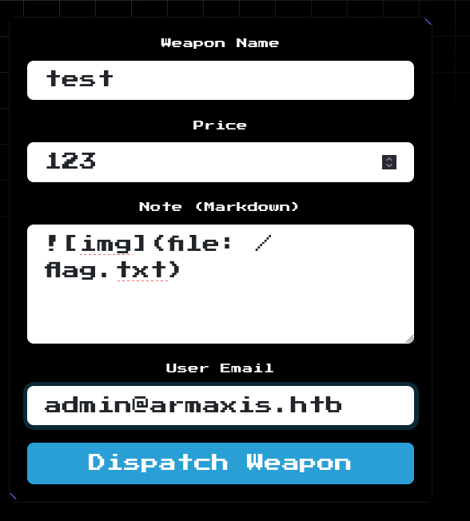

<div style="height: 5px;"></div>

- Que me da como respuesta:
    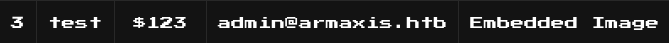

<div style="height: 5px;"></div>

- Aplico un Ctrl + Shift + C sobre la imagen embebida:
    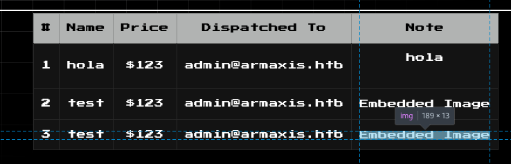

<div style="height: 5px;"></div>

- Veo que me da un codigo en base 64:
    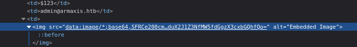

<div style="height: 5px;"></div>

- Le hago un echo y consigo la flag:
```js
┌──(root㉿kali)-[/home/…/HTB/Challenge/web_armaxis/challenge]
└─# echo -n "SFRCe200cmtkMHduX2JIZ3NfMW5fdGgzX3cxbGQhfQo=" | base64 -d
HTB{m4rkd0wn_bHgs_1n_th3_w1ld!}
```