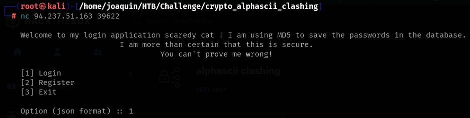
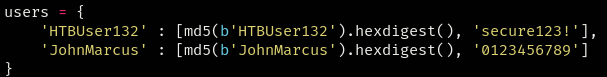
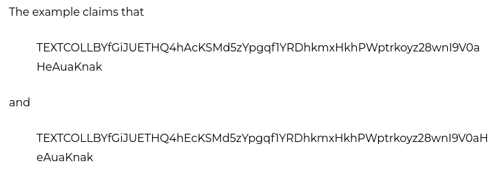
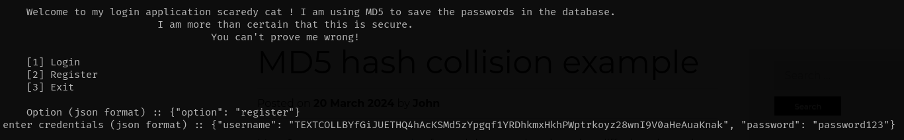
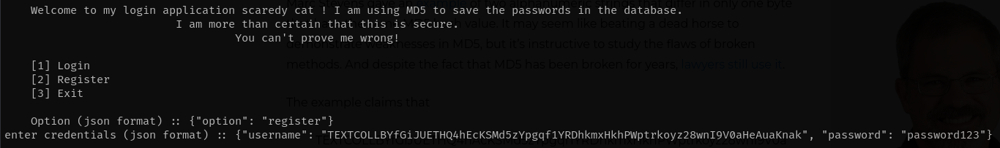
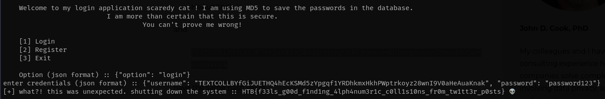

### Paso a paso:


- Entro a la web usando nestat en la terminal:
    

<div style="height: 5px;"></div>

- Descargo y descomprimo el archivo, la contrasena como siempre es "hackthebox".

<div style="height: 5px;"></div>

- Veo el código de server.py.

<div style="height: 5px;"></div>

- Y encuentro a usuario logeados:
    
    
<div style="height: 5px;"></div>

- Veo q puedo logearme yo con {"option": "login"}:
```js
def main():
    while True:
        option = json.loads(get_option())

        if 'option' not in option:
            print('[-] please, enter a valid option!')
            continue

        option = option['option']
        if option == 'login':
            creds = json.loads(input('enter credentials (json format) :: '))

            usr, pwd = creds['username'], creds['password']
            usr_hash = md5(usr.encode()).hexdigest()
            for db_user, v in users.items():
                if [usr_hash, pwd] == v:
                    if usr == db_user:
                        print(f'[+] welcome, {usr} 🤖!')
                    else:
                        print(f"[+] what?! this was unexpected. shutting down the system :: 
                        {open('flag.txt').read()} 👽")
                        exit()
                    break
            else:
                print('[-] invalid username and/or password!')
```

<div style="height: 5px;"></div>

- Ademas veo que puedo crear usuarios:
```js
elif option == 'register':
    creds = json.loads(input('enter credentials (json format) :: '))
```

<div style="height: 5px;"></div>

- Y puedo ver que puedo acceder a la flag:
```js
usr, pwd = creds['username'], creds['password']
if usr.isalnum() and pwd.isalnum():
    usr_hash = md5(usr.encode()).hexdigest()
    if usr not in users.keys():
        users[usr] = [md5(usr.encode()).hexdigest(), pwd]
    else:
        print('[-] this user already exists!')
else:
    print('[-] your credentials must contain only ascii letters and digits.')
```

<div style="height: 5px;"></div>

- Lo que veo también es que hay una colisión de hashes.

<div style="height: 5px;"></div>

- Por lo que busco hashes que tengan colisión:
    

<div style="height: 5px;"></div>

- Y compruebo que tiene los mismo hashes:
```js
┌──(root㉿kali)-[/home/joaquin/HTB/Challenge/crypto_alphascii_clashing]
└─# python
Python 3.13.2 (main, Mar 13 2025, 14:29:07) [GCC 14.2.0] on linux
Type "help", "copyright", "credits" or "license" for more information.
>>> from hashlib import md5
>>> md5(b"TEXTCOLLBYfGiJUETHQ4hAcKSMd5zYpgqf1YRDhkmxHkhPWptrkoyz28wnI9V0aHeAuaKnak") . hexdigest()
'faad49866e9498fc1719f5289e7a0269'
>>> md5(b"TEXTCOLLBYfGiJUETHQ4hEcKSMd5zYpgqf1YRDhkmxHkhPWptrkoyz28wnI9V0aHeAuaKnak") . hexdigest()
'faad49866e9498fc1719f5289e7a0269'
>>> 
```


<div style="height: 5px;"></div>

- Los registro a ambos:
    

    

<div style="height: 5px;"></div>

- Y al entrar con el ultimo y haber una colisión de hashes me devuelve la flags:
    