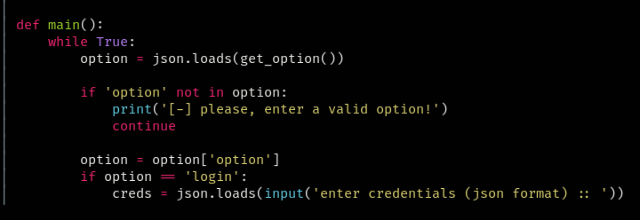
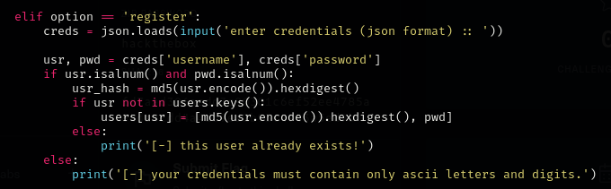
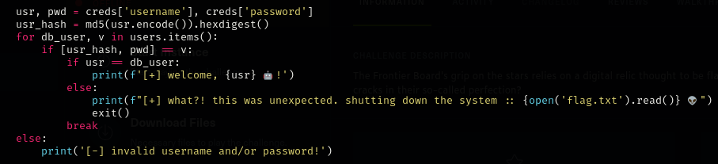
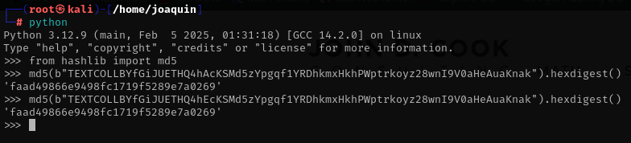

### Paso a paso:

- Entro a la web usando nestat en la terminal:
    

- Descargo y descomprimo el archivo, la contrasena como siempre es "hackthebox".

- Veo el código de server.py.

- Y encuentro a usuario logeados:
    
    

- Veo q puedo logearme yo con {"option": "login"}:
    

- Ademas veo que puedo crear usuarios:
    

- Y puedo ver que puedo acceder a la flag:
    

- Lo que veo también es que hay una colisión de hashes.

- Por lo que busco hashes que tengan colisión:
    

- Y compruebo que tiene los mismo hashes:
    

- Los registro a ambos:
    
    

- Y al entrar con el ultimo y haber una colisión de hashes me devuelve la flags:
    