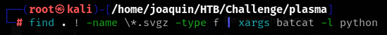

### Paso a paso:

- Descargo el archivo .zip que me dan para el ejercicio.

- Lo muevo a mi carpeta de trabajo.

- Y lo descomprimo usando unzip, acordarse que la contrasena siempre va a ser "hackthebox": 

- Entro al archivo y empiezo a mirar y pido un tree para ver ordenadamente todo lo q contiene el directorio:
    

- Le pido que me muestre todo pero sin los .svgz y sin las carpetas:
    

- Y le pido abrir lo con batcat:
    

- Al revisar todo encuentro un echo:
    

- Lo ejecuto y descubro la flag:
    