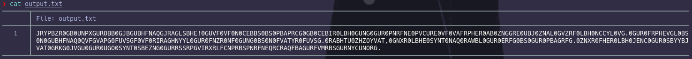

### Paso a paso:

- Descargo y descomprimo el archivo, la contrasena como siempre es "hackthebox".

<div style="height: 5px;"></div>

- Hago un cat del .txt:
    

<div style="height: 5px;"></div>

- Cambio los 0 por espacios:
    

<div style="height: 5px;"></div>

- Veo que "GUR" se repite asique le cambio de color para verlo mejor:
    

<div style="height: 5px;"></div>

- Parece ser un cifrado cesar entonces veo eso y muestro cual seria el proceso para llegar:
      
    
<div style="height: 5px;"></div>

- Y lo pruebo con el .txt:
    

<div style="height: 5px;"></div>

- Y ahi esta la flag:
```js
WELCOME TO HACKTHEBOO TWOTHOUSANDTWENTYFOUR! THIS IS A PROOF OF CONCEPT TO PROVE YOU THAT THE CAESAR CIPHER IS INSECURE NO MATTER HOW MANY TIMES YOU APPLY IT. THE SECURITY OF A THOUSAND DISTINCT SHIFTS IS EVENTUALLY THE SAME AS THAT OF A SINGLE SHIFT. ENOUGH MUMBLING, TAKE YOUR FLAG AND ENJOY THE REST OF THE CONTEST. MAKE SURE YOU WRAP THE FOLLOWING TEXT WITH THE HTB FLAG FORMAT THEEFFECTIVEKEYSPACEOFCAESARDEPENDSONTHESIZEOFTHEALPHABET.%  
```

<div style="height: 5px;"></div>

- Escribo la flag en el formato corresponfiente:
```js
HTB{THEEFFECTIVEKEYSPACEOFCAESARDEPENDSONTHESIZEOFTHEALPHABET}
```